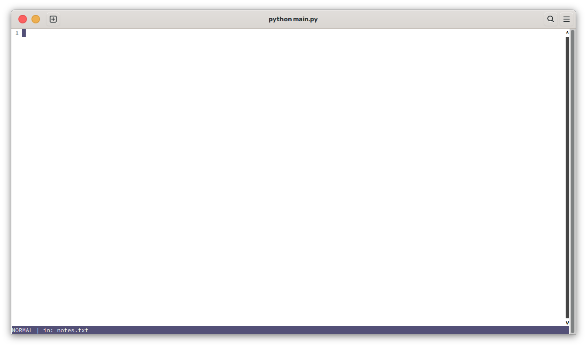

# scrappad
this is a super simple vim-like notetaking app i made for myself

# features
super basic vim keybinds:
`:w` --- save
`:q` --- quit (`:q!` to force quit)
`:wq` -- write and quit
`i` ---- insert mode

default folder for notes is at ~/.config/scrappad

# screenshots

# roadmap
- [ ] make program run faster
- [ ] add support for markdown
- [ ] add support for exporting notes
- [ ] autosave?
